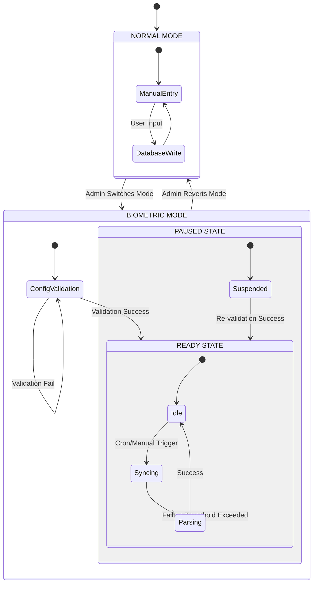

# HRMS Attendance System Design

## 1. State Transition Diagram



---

## 2. Data Model

### A. Raw Punch Logs Table (`raw_punch_logs`)
Stores immutable raw data fetched from biometric devices.

| Column Name | Type | Constraints | Description |
| :--- | :--- | :--- | :--- |
| `id` | UUID | PK | Unique Log ID |
| `biometric_id` | VARCHAR(50) | NOT NULL, INDEX | User ID from device |
| `punch_datetime` | DATETIME | NOT NULL, INDEX | Exact timestamp of punch |
| `device_ip` | VARCHAR(45) | NULL | IP of source device |
| `direction` | ENUM | 'IN', 'OUT', 'AUTO' | Direction if available (often Auto) |
| `process_status` | ENUM | 'PENDING', 'PROCESSED', 'FAILED' | Sync status |
| `source_type` | ENUM | 'ESSL_DB', 'DIRECT_DEVICE', 'CSV' | Origin of the log |
| `error_log` | TEXT | NULL | If processing failed |
| `synced_at` | DATETIME | DEFAULT NOW() | When system received record |

**Deduplication Rule**:
Composite unique constraint on `(biometric_id, punch_datetime, device_ip)`. Duplicate punches encountered during sync must be silently ignored (skip insert).

### B. Daily Attendance Table (`daily_attendance`)
Stores the calculated attendance for the day.

| Column Name | Type | Constraints | Description |
| :--- | :--- | :--- | :--- |
| `id` | UUID | PK | Unique Record ID |
| `employee_id` | UUID | FK | Reference to Employee |
| `date` | DATE | NOT NULL, INDEX | Attendance Date |
| `status` | ENUM | 'PRESENT', 'ABSENT', 'HALF_DAY', ... | Final status |
| `check_in` | DATETIME | NULL | First punch of day |
| `check_out` | DATETIME | NULL | Last punch of day |
| `raw_punch_ids` | JSON | NULL | Array of `raw_punch_logs.id` used |
| `work_hours` | FLOAT | DEFAULT 0 | Total hours worked |
| `overtime_hours` | FLOAT | DEFAULT 0 | OT Hours |
| `late_minutes` | INT | DEFAULT 0 | Late arrival duration |
| `is_manual_override` | BOOLEAN | DEFAULT FALSE | If edited by Admin |
| `calculation_version` | INT | DEFAULT 1 | Version of calculation, for recalculations |
| `attendance_source` | ENUM | 'BIOMETRIC', 'MANUAL', 'ADJUSTED' | Origin of the attendance record |

### C. System Settings (JSON Config)
Stored in `system_settings` table under key `ATTENDANCE_CONFIG`.
**Security Note**: Sensitive credentials (passwords, secrets) are NOT stored in this config. They are managed via environment variables or a secret manager, referenced here by ID.

```json
{
  "mode": "NORMAL", // or "BIOMETRIC"
  "biometric_config": {
    "source_type": "ESSL_DB", // or "DIRECT_DEVICE"
    "essl_db": {
      "type": "mssql",
      "host": "192.168.1.100",
      "credential_ref": "SECURE_CRED_ESSL_01", // References external secret
      "db_name": "eTimeTrackLite",
      "table_name": "DeviceLogs_Processing"
    },
    "direct_device": {
      "ip": "192.168.1.201",
      "port": 4370,
      "polling_interval_min": 15
    },
    "mapping_rule": "biometric_id" // maps to employee_code
  },
  "sync_enabled": false
}
```

---

## 3. API Contract (Biometric Sync Service)

### A. Update Configuration & Mode
`PUT /api/attendance/config`
**Request Body**: (Same as previous, but omit plain text passwords)
**Response**:
```json
{
  "success": true,
  "message": "Configuration updated. Validation pending."
}
```

### B. Test Connectivity & Validation
`POST /api/attendance/validate`
**Purpose**: Triggers the 'Validation Steps' before entering READY state or recovering from PAUSED.
**Response**:
```json
{
  "success": true,
  "overall_status": "PASS", // or WARN, FAIL
  "checks": {
    "connection": "PASS",
    "table_access": "PASS",
    "sample_read": "PASS",
    "mapping_check": "PASS",
    "time_sync": "WARN" // Example of non-blocking warning
  },
  "warnings": [
    "Device time is drifting by 2 minutes."
  ],
  "sample_data": {
    "biometric_id": "101",
    "punch_time": "2023-10-27 09:00:00"
  }
}
```

### C. Manual Sync Trigger
`POST /api/attendance/sync`
**Query Params**:
- `dry_run=true` (Optional): If true, fetches and parses logs but does NOT insert into DB.

**Response**:
```json
{
  "job_id": "sync_12345",
  "status": "STARTED",
  "mode": "DRY_RUN" // or LIVE
}
```

### D. Get Sync Status
`GET /api/attendance/sync/status`
**Response**:
```json
{
  "mode": "BIOMETRIC",
  "state": "READY", // READY, PAUSED
  "last_sync": "2023-10-27T10:00:00Z",
  "status": "IDLE", // SYNCING, ERROR
  "last_error": null,
  "stats": {
    "today_logs_fetched": 150,
    "pending_processing": 0
  }
}
```

---

## 4. Validation Checklist (Pre-Ready State)

Before setting `system_settings.sync_enabled = true` and `mode = BIOMETRIC`, the backend must verify:

1.  **Network Reachability**:
    *   [ ] Ping Host/Device IP.
    *   [ ] Telnet Port (1433 for MSSQL, 3306 for MySQL, 4370 for Device).

2.  **Authentication**:
    *   [ ] Authenticate using referenced credentials (via `credential_ref`).

3.  **Schema/Data Access**:
    *   [ ] `SELECT TOP 1 * FROM [Table]` returns data (for DB).
    *   [ ] Device returns valid handle (for Direct).

4.  **Time Sync Check**:
    *   [ ] Compare Server Time vs Device/DB Time.
    *   [ ] **Action**: WARN if delta > defined threshold (e.g., 5 mins), do not fail validation.

5.  **Mapping Check**:
    *   [ ] Fetch distinct `biometric_id` list from source.
    *   [ ] Check overlap with local `employees.employee_code`.
    *   [ ] **Pass Condition**: >0 matched users found.

6.  **Write Permissions**:
    *   [ ] Verify `raw_punch_logs` is writable in local DB.

7.  **Duplicate Punch Detection**:
    *   [ ] Verify logic exists to handle pre-existing punches without error.

8.  **Clock Drift Policy**:
    *   [ ] Ensure acceptable drift policy is configured. WARN if exceeded.
